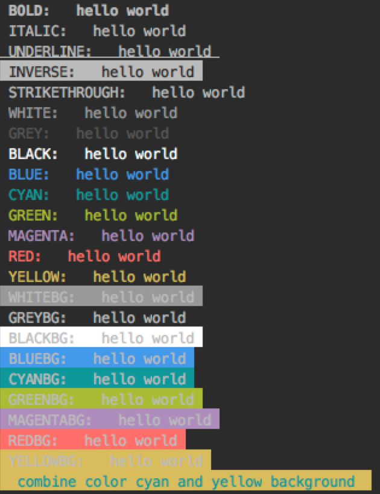

# node-cli
node 命令行开发

## color
控制台输出颜色化，效果图:



## dict
使用推酷上用的有道词典查询接口，实现输入单词进行查询。

## global
普通js文件到系统可执行命令中间都发生了些什么？

1. 添加shebang

2. 添加可执行权限chmod +x filename

3. 使用npm init生成package.json文件，

4. 在package.json文件中添加bin字段

5. 使用npm link链接到全局

## minimist
minimist解析参数 [详细请见:https://github.com/substack/minimist](https://github.com/substack/minimist)

## shebang
设置不同的默解释程序，再不同node环境下运行。

## sync-github
一键同步到github上， [原理](http://www.jianshu.com/p/19d2f3a3b5d8)大致为：

1. 使用浏览器书签获取需要保存的页面的title和url，然后发送到后端

2. 获取相关title和url，先保存到本地文件，然后提交到github上

[点击查看已经上传的书签](./sync-github/bookmark.md)

使用说明：

1. 先用浏览器打开`sync-github/bookmark.html`

2. 把页面里边的链接拖动到书签栏，保存为书签`bookmark`

3. 启动服务器
  ```
  node server.js
  ```
  
4. 在需要保存到github的页面，点击刚刚保存的`bookmark`书签
